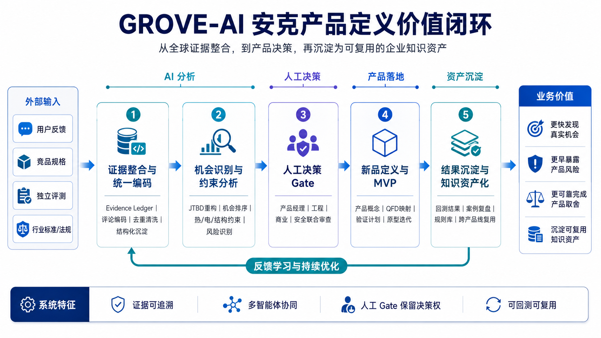

# GROVE-AI 的安克业务价值

GROVE-AI 的核心价值不是“AI 能生成多少创意”，而是降低从全球证据到产品决策过程中的信息、协作和试错损耗。

## 五类价值

| 价值维度 | 当前损耗 | GROVE-AI 机制 | 可观察的验收信号 | 当前状态 |
|---|---|---|---|---|
| 信息处理效率 | 多渠道资料重复收集、整理和同步 | 统一 Evidence Ledger 与字段口径 | 证据复用率、重复记录率、研究周期 | `Planned` |
| 决策质量 | 高频意见替代证据，方案难以解释 | FACT/INFERENCE/HYPOTHESIS 分离，机会绑定反证 | 结论可追溯率、争议闭环率 | `In Progress` |
| 工程风险前置 | 热、结构、认证与成本冲突暴露过晚 | 工程/安全 Agent、QFD、Kill Gate | 样机前识别的高风险项、未关闭风险数 | `Planned` |
| 跨团队协作 | 产品、工程、市场口径不一致 | 结构化交接、责任人、人工 Gate | 返工次数、Gate 等待时间、责任覆盖率 | `Planned` |
| 知识资产沉淀 | 项目结束后证据和失败经验散失 | 品类适配器、规则库、案例库、版本记录 | 下一品类复用字段与规则的比例 | `In Progress` |

这些指标用于定义验收方法，不代表当前已经改善了研究周期、退货率或用户满意度。

## 方法能力如何翻译成企业语言

| 方法能力 | 企业收益表达 |
|---|---|
| Evidence Ledger | 降低证据丢失和观点争议 |
| 多角色分工 | 让用户、工程、安全和商业约束更早进入决策 |
| 历史回测 | 检验系统是否只是事后解释 |
| 工程红队 | 在样机投入前暴露不可实现规格 |
| 品类适配器 | 将一次研究沉淀为跨产品线资产 |
| 人工 Gate | 保留产品负责人的最终决策权和责任链 |

## 业务价值闭环

每一次项目不仅输出概念，还将新证据、工程规则、否决理由和实验结果回写到系统，为下一产品线提供更好的起点。

## 飞书的角色

飞书是入围后拟采用的企业协作与治理载体，用于承载证据表、产品基准库、机会看板、风险责任人、人工 Gate 和版本记录。它不构成 GROVE-AI 的核心算法或创新主张。
