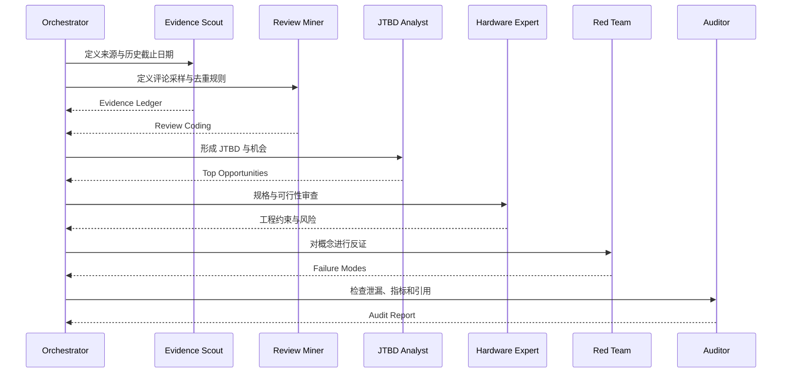
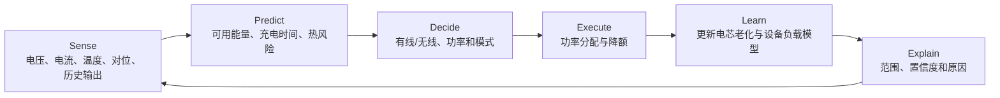

# GROVE-AI：面向消费电子产品定义的证据驱动多智能体研究框架

> **研究对象：** 10,000mAh 磁吸无线充电宝  
> **锚定品牌：** Anker  
> **候选产品方向：** Anker MagGo Compass 10K  
> **候选智能系统：** PowerPilot AI  
> **研究性质：** 产品设计研究、AI Agent 工作流研究、历史桌面回测与工程可行性验证

---

## 摘要

消费电子产品定义长期依赖产品经理的经验、有限用户访谈和竞品拆解，容易产生证据选择偏差、功能堆叠、需求与工程约束脱节，以及“产品发布后再解释为什么成功”的事后归因问题。本课题拟提出并实现 **GROVE-AI**：一套面向消费电子产品定义的证据驱动、多智能体协作与可回测研究框架。

GROVE-AI 包含五个连续阶段：**Ground Evidence（证据落地）**、**Reframe the Job（任务重构）**、**Orchestrate Agents（智能体编排）**、**Verify Adversarially（对抗验证）**、**Engineer & Experiment（工程化与实验）**。框架综合吸收人本设计、Jobs to Be Done、持续产品发现、质量功能展开、失效模式分析和历史回测思想，要求所有核心结论区分 `FACT`、`INFERENCE` 与 `HYPOTHESIS`，并通过证据账本、时间切分、外部品牌控制、红队审查和消融实验降低幻觉与事后合理化风险。

本研究选择 **10,000mAh 磁吸无线充电宝**作为首个验证品类。初步样本显示，同容量产品已形成“智能屏显与支架”“超薄便携”“内置线材与性价比”“Qi2 25W 高速无线”等差异化路线，但高无线功率、低温升、超薄、低重量、大容量、强结构功能之间存在明显的多目标冲突。用户对标称容量、实际可用能量、剩余补电次数、热降速和携带负担的理解仍可能存在不确定性。因此，本课题提出候选概念 **Anker MagGo Compass 10K**，并将 **PowerPilot AI** 作为本地优先的能量预测与充电策略系统，通过“感知—预测—决策—执行—学习—解释”闭环，把充电宝从被动储能附件转化为可解释的移动能源助手。

截至本报告形成时，仅完成了小规模公开资料样例编码，尚未完成预定的 20–50 个 SKU、500–5,000 条去重用户反馈的大规模回测。因此，本文中的样本统计、机会评分和产品规格均属于**开题阶段样例或待验证假设**，不得视为已经取得的实验结论。

**关键词：** AI 原生产品设计；多智能体系统；消费电子；磁吸充电宝；用户洞察；JTBD；QFD；历史回测；产品定义；Agent Skill

---

## 目录

- [1. 研究背景与问题提出](#1-研究背景与问题提出)
- [2. 研究目标、研究问题与假设](#2-研究目标研究问题与假设)
- [3. 研究对象、边界与概念定义](#3-研究对象边界与概念定义)
- [4. 国内外方法与相关研究](#4-国内外方法与相关研究)
- [5. GROVE-AI 总体方法](#5-grove-ai-总体方法)
- [6. 多智能体协作设计](#6-多智能体协作设计)
- [7. 数据方案与样本设计](#7-数据方案与样本设计)
- [8. 数据分析方法与评价指标](#8-数据分析方法与评价指标)
- [9. 初步数据分析样例](#9-初步数据分析样例)
- [10. 候选产品概念与技术路线](#10-候选产品概念与技术路线)
- [11. 历史桌面回测方案](#11-历史桌面回测方案)
- [12. 实验计划与工程验证](#12-实验计划与工程验证)
- [13. 研究笔记](#13-研究笔记)
- [14. 研究进度与里程碑](#14-研究进度与里程碑)
- [15. 预期成果](#15-预期成果)
- [16. 风险、伦理与数据合规](#16-风险伦理与数据合规)
- [17. GitHub 仓库建议结构](#17-github-仓库建议结构)
- [18. 参考资料清单](#18-参考资料清单)
- [附录 A：数据字典](#附录-a数据字典)
- [附录 B：样例数据记录](#附录-b样例数据记录)
- [附录 C：开题阶段验收清单](#附录-c开题阶段验收清单)

---

# 1. 研究背景与问题提出

## 1.1 赛题背景

本课题来源于安克创新相关 AI 原生产品设计命题。赛题要求参赛者选择安克产品品类，设计并展示一套 AI 原生的产品设计与定义工作流，同时输出用户洞察、产品概念、可行性论证，并说明该方法相较传统经验驱动方法的改进。[R00]

赛题的核心并非单纯生成一个外观概念，而是回答两个层面的问题：

1. **产品层面：** AI 能否帮助团队定义一个更有价值、更可信、更可实现的消费电子产品？
2. **方法层面：** 这一过程能否沉淀为可重复使用、可审计、可协作的智能体工作流？

因此，项目成果应同时包括一个产品提案和一套可复用的产品定义系统。

## 1.2 行业技术环境变化

Wireless Power Consortium 已将 Qi2 25W 作为 Qi v2.2.1 的品牌化能力，于 2025 年推出，意味着磁吸无线充电从 15W 进入更高功率阶段。[R09] 功率提高能够缩短充电时间，但同时会放大热管理、线圈对位、转换效率、材料、结构和系统降额问题。

航空出行要求也直接影响充电宝的产品定义。中国民航局自 2025 年 6 月 28 日起，禁止旅客携带无 3C 标识、标识不清晰以及被召回型号或批次的充电宝乘坐境内航班。[R10] IATA 则要求移动电源作为备用锂电池放入随身行李，通常 100Wh 及以下可随身携带，100–160Wh 可能需要航空公司批准。[R11] 10,000mAh、约 38Wh 的产品虽然一般低于 100Wh，但标识清晰、认证状态、召回信息和飞行场景交互仍应成为产品体验的一部分，而不能只在说明书中被动呈现。

## 1.3 传统产品定义流程的主要问题

### 1.3.1 证据碎片化

官方产品页、用户评论、社区讨论、独立评测、标准文件与内部访谈使用不同口径。团队容易选择性引用支持既定观点的资料，却忽视反证、版本差异和地区差异。

### 1.3.2 用户需求被简化为功能愿望

“想要更快”“想要更薄”“想要更大容量”并不等同于完整需求。真实任务包含使用场景、失败代价、替代方案和可接受妥协。脱离场景的功能清单容易导致功能堆叠。

### 1.3.3 产品与工程分离

高无线功率、低温升、超薄、低重量、大容量、支架、屏幕和内置线材会竞争有限的体积、热预算和成本预算。若工程评审介入过晚，概念会在样机阶段大幅缩水。

### 1.3.4 合成用户被误用

LLM 合成用户适合扩大问题空间、测试表达和发现边界场景，但缺少真实生活历史、购买约束和承担后果的关系结构。相关研究指出，合成用户可以支持设计者进行反馈和假设测试，但不能自动替代真实用户研究；其代表性与生态效度需要透明说明。[R06][R07][R08]

### 1.3.5 缺少可回测性

许多产品方法只能在项目完成后叙述“我们如何洞察用户”，却无法证明在未知未来结果时能否提前识别痛点和取舍。缺少时间切分会造成严重的数据泄漏与事后合理化。

---

# 2. 研究目标、研究问题与假设

## 2.1 总体目标

构建一套可被 Codex、ChatGPT、Claude Code 或其他智能体系统调用的消费电子产品定义 Skill，并在 10,000mAh 磁吸无线充电宝品类上完成严格的历史桌面回测、产品概念生成和工程验证设计。

## 2.2 具体目标

1. 建立可追溯的消费电子产品证据账本。
2. 将评论与规格转换为场景化 JTBD，而非功能愿望。
3. 构建多智能体协作、冲突裁决与人工 Gate。
4. 设计严格时间切分的历史回测。
5. 评估红队、工程专家、合成用户和 QFD 模块的真实贡献。
6. 形成 Anker 磁吸充电宝的 AI 原生产品概念。
7. 抽象为可迁移至耳机、充电器、投影仪和户外电源的 Agent Skill。

## 2.3 研究问题

### RQ1：证据问题

如何将异构公开资料转换为可追溯、可去重、可比较的产品证据，而不把单条评论误当作市场规律？

### RQ2：方法问题

多智能体 GROVE-AI 是否比单模型自由生成、仅竞品分析或仅评论总结，更能识别后续真实出现的用户痛点和工程取舍？

### RQ3：验证问题

如何通过历史截止日期、留出品牌与留出产品族，区分真正的预测能力和事后解释能力？

### RQ4：产品问题

在 10,000mAh 磁吸充电宝中，用户是否更需要“可信的剩余能源与策略解释”，而不仅是继续提高标称功率或增加结构功能？

### RQ5：协作问题

如何把产品经理、用户研究、硬件工程、认证安全、商业分析和红队角色编码为可复用的 Agent Skill？

## 2.4 研究假设

| 编号 | 研究假设 | 验证方式 |
|---|---|---|
| H1 | 完整 GROVE-AI 的 Pain Recall@K 高于单模型自由生成基线 | 历史案例配对回测 |
| H2 | 引入硬件工程与安全智能体后，不可行规格比例下降 | 工程审查与消融实验 |
| H3 | 红队模块能够降低无证据结论率和功能堆叠程度 | 前后对照编码 |
| H4 | 合成用户能够增加边界场景数量，但不能可靠估计真实用户比例 | 人类访谈对照与分布检验 |
| H5 | “剩余可用补电范围”比单一电量百分比更能提升能源确定感 | 原型可用性实验 |
| H6 | 解释性策略选择能够提高用户对降速与发热控制的接受度 | 情境实验与信任量表 |
| H7 | 一个核心 JTBD、最多三个差异化的约束能降低概念复杂度 | 专家盲评与认知负荷测试 |

---

# 3. 研究对象、边界与概念定义

## 3.1 研究对象

主研究对象为：

> 面向磁吸兼容智能手机、标称容量约 10,000mAh、具备无线输出能力的便携式移动电源。

## 3.2 纳入标准

- 标称容量位于 9,000–11,000mAh；
- 具备磁吸无线充电；
- 主要用于智能手机随身补电；
- 在公开市场正式销售；
- 存在可验证的官方规格页面；
- 有一定独立评测或用户反馈；
- 上市时间和产品版本可识别。

## 3.3 排除标准

- 5,000mAh 或 20,000mAh 产品作为主样本；
- 桌面式多合一无线充电座；
- 无磁吸功能的普通充电宝；
- 无法区分版本的白牌产品；
- 只有营销图、没有可验证规格的产品；
- 众筹但未交付产品。

## 3.4 核心概念

### AI 原生产品

AI 不只是生成文案或效果图，而是进入产品定义和产品使用闭环，持续承担感知、预测、决策、执行、学习或解释中的至少一个关键环节。

### 桌面回测

在历史时点冻结可用证据，先生成产品机会和风险预测，再解封产品发布后的资料进行比较。

### Evidence Ledger

记录每条证据的来源、时间、产品、主张、支持或反对关系、置信度和历史可用性的结构化账本。

### 合成用户

由 LLM 根据真实资料构建的可交互用户代理，用于发现问题和压力测试，不用于替代真实用户样本。

### Agent Skill

包含说明、示例、模板、脚本与支持文件的可复用工作流。OpenAI 将 Skills 定义为可重复使用、可共享，并可包含指令、示例和代码的工作流；Skills 也可用于 Codex。[R24]

---

# 4. 国内外方法与相关研究

## 4.1 人本设计与 Design Thinking

IDEO 将设计思维描述为同时平衡用户需要、技术可行性与商业可持续性的设计方法，并强调灵活迭代，而非固定线性步骤。[R01][R02]

本课题吸收其以下原则：

- 从真实场景开始；
- 发散与收敛交替；
- 尽早将概念具体化；
- 通过原型学习；
- 同时评估 desirability、feasibility 与 viability。

其不足在于：传统设计思维通常不规定证据账本、历史回测和多智能体审计方法。

## 4.2 Jobs to Be Done

JTBD 将用户需求表达为在特定情境下希望完成的进步，而不是静态人口属性或功能偏好。GROVE-AI 使用以下格式：

> 当我处于【场景】并受到【约束】时，我想完成【任务】，从而获得【结果】，但当前方案因为【障碍】让我付出【代价】。

JTBD 用于避免把“25W”“屏幕”“支架”本身当作用户需求。

## 4.3 持续产品发现

Continuous Discovery 强调从明确结果出发，持续访谈发现机会，并快速测试方案假设；Opportunity Solution Tree 可用于维持目标、机会与方案之间的可追踪关系。[R05]

本课题在此基础上加入：

- 历史时点冻结；
- 证据层级；
- 多智能体角色分离；
- 工程和合规前置；
- 消融实验。

## 4.4 QFD 与 House of Quality

ASQ 将 QFD 描述为系统倾听客户声音并将其转化为产品和工程要求的方法；House of Quality 用于建立客户需求与技术实现之间的关系。[R03][R04]

在本课题中，QFD 负责将以下需求：

- “我想知道还能撑多久”
- “我不想因为过热突然停止”
- “我不想额外带线”

转换为：

- 剩余能量预测误差；
- 温度、功率与降额曲线；
- 线材寿命与可替换性；
- 厚度和重量预算；
- 交互信息层级。

## 4.5 合成用户研究

2025 年发表于 *AI EDAM* 的研究表明，基于 LLM 的合成用户可以支持设计者进行假设测试与反馈交互，但会造成用户属性理解的更大差异，需要控制一致性与变化性。[R06]

对 2023–2025 年合成人格实验的综述指出，研究常常没有充分定义任务、目标群体和代表性，只有部分工作讨论了生态有效性。[R07] 另一项人类访谈与合成人格的对照研究发现，两者既有重合，也存在“人类独有”和“合成用户独有”的主题，支持把合成用户视为补充模拟，而不是经验研究替代品。[R08]

## 4.6 本课题的方法差异

| 方法 | 优点 | 主要不足 | GROVE-AI 增强 |
|---|---|---|---|
| Design Thinking | 人本、迭代、原型化 | 证据审计不足 | Evidence Ledger、回测 |
| JTBD | 聚焦场景与任务 | 工程映射不足 | QFD、硬件专家 |
| Continuous Discovery | 持续发现与假设测试 | 历史预测验证较弱 | 时间切分、留出集 |
| QFD | 需求到工程指标 | 用户证据可能粗糙 | 多源评论编码 |
| FMEA | 识别故障与风险 | 创新机会不足 | 与 JTBD 和概念共同运行 |
| LLM 合成用户 | 快速、可扩展 | 代表性和生态效度不足 | 真实证据绑定、禁止估比例 |
| 单模型产品生成 | 快速 | 幻觉、迎合、功能堆叠 | 角色分离、红队、Gate |

---

# 5. GROVE-AI 总体方法

## 5.1 框架概览


## 5.2 G：Ground Evidence

主要任务：

1. 定义品类边界与控制变量；
2. 收集官方规格、标准、独立评测和用户反馈；
3. 建立来源登记表；
4. 对评论去重；
5. 对证据标注 `FACT / INFERENCE / HYPOTHESIS`；
6. 记录支持与反证；
7. 完成时间有效性检查。

### Gate G

- 核心结论可追溯率达到 100%；
- 未标记假设的无证据结论为 0；
- 每个 Top 机会至少两类来源；
- 版本、市场和时间范围明确；
- 重复内容得到处理。

## 5.3 R：Reframe the Job

将评论转换为：

- 场景；
- 触发条件；
- 功能任务；
- 情绪任务；
- 当前替代方案；
- 失败代价；
- 成功标准。

最终只选择一个核心 JTBD，避免同时面向所有用户。

## 5.4 O：Orchestrate Agents

通过角色分工减少单模型同时“提出方案并评价自己”的偏差。所有智能体通过结构化文件交接，并保留版本历史。

## 5.5 V：Verify Adversarially

采用：

- 历史截止日期；
- 留出品牌；
- 留出产品族；
- 红队；
- 反证分析；
- 消融实验；
- 泄漏审计。

## 5.6 E：Engineer & Experiment

将产品概念转化为：

- 热设计预算；
- 电气架构；
- 结构尺寸；
- 安全与认证要求；
- 可靠性实验；
- BOM 和价格假设；
- MVP 和 Kill Gate。

---

# 6. 多智能体协作设计

## 6.1 智能体角色

| 智能体 | 主要输入 | 主要输出 | 关键限制 |
|---|---|---|---|
| Orchestrator | 任务、运行状态 | 分工、Gate、版本 | 不直接掩盖冲突 |
| Evidence Scout | 官方与标准资料 | Evidence Ledger | 不做无来源结论 |
| Review Miner | 评论与论坛 | 去重、主题编码 | 不把评论数当市场占比 |
| JTBD Analyst | 编码结果 | Job Map | 不先绑定功能 |
| Opportunity Ranker | Job 与证据 | 机会排序 | 公式不自动替代决策 |
| Synthetic User Arena | 真实证据与情境 | 边界场景、反对理由 | 不代替真实用户 |
| Hardware Expert | 概念与规格 | 电热结构评审 | 不接受未验证性能 |
| Safety Expert | 标准、法规、召回 | 合规路径 | 必须记录地区与日期 |
| Commercial Expert | 价格与产品线 | 成本、渠道、蚕食分析 | 不虚构销量 |
| Concept Architect | Top 机会 | 概念候选 | 差异化不超过三项 |
| Red Team | 完整提案 | 反证与失败模式 | 与提案者角色分离 |
| Evaluation Auditor | 预测和观察数据 | 泄漏与指标审计 | 不修改原预测 |

## 6.2 协作流程



## 6.3 Agent 交接格式

```yaml
handoff_id: H-001
from_agent: Evidence Scout
to_agent: JTBD Analyst
objective: 将证据转换为候选任务
inputs:
  - E-001
  - E-002
outputs_expected:
  - J-001
assumptions:
  - 仅适用于目标市场与指定产品版本
uncertainties:
  - 评论样本偏向主动发声用户
blockers: []
next_gate: R
```

---

# 7. 数据方案与样本设计

## 7.1 数据来源层级

| 层级 | 来源 | 用途 | 限制 |
|---|---|---|---|
| L1 | 标准、监管、认证机构 | 安全、功率、运输和认证 | 地区与版本必须匹配 |
| L2 | 品牌官方页面、说明书、召回公告 | 规格、定位、功能 | 属于品牌自述 |
| L3 | 独立实验型评测 | 实际容量、速度、温度、体验 | 测试条件可能不同 |
| L4 | 大型零售平台反馈 | 高频使用问题 | 存在激励评价与选择偏差 |
| L5 | 社区、论坛、社交媒体 | 发现边界问题和失败案例 | 不能估计市场比例 |
| L6 | 合成用户 | 压力测试和假设扩展 | 不是真实样本 |

## 7.2 目标样本规模

### 最低可运行规模

- 4 款同类产品；
- 至少 1 款外部品牌控制；
- 100 条去重反馈；
- 至少 3 类来源；
- 至少 2 个上市时间点。

### 正式回测推荐规模

- 20–50 个 SKU；
- 500–5,000 条去重反馈；
- 3 个以上价格带；
- 2 个以上市场；
- 3 个以上上市批次；
- 至少 1 个留出品牌；
- 至少 1 个留出产品族。

## 7.3 初步产品样本

> 本表为开题阶段公开资料样例，不代表完整市场样本。价格为访问时页面价格或评测列示价格，具有波动性；缺失项保持 `N/A`，不得自行填充。

| ID | 产品 | 容量 | 无线输出 | 有线输出 | 厚度 | 重量 | 结构功能 | 样例价格 | 资料 |
|---|---|---:|---:|---:|---:|---:|---|---:|---|
| P01 | Anker MagGo 10K A1654 | 10,000mAh / 38.5Wh | 15W Qi2 | 27W | 19.8mm | 250g | 屏幕、折叠支架 | US$89.99 | [R13] |
| P02 | Anker MagGo 10K Slim A1664 | 10,000mAh | 15W Qi2 | 30W | 14.7mm | 约 200g | 超薄，无支架 | US$79.86 | [R14][R19] |
| P03 | Anker Zolo Magnetic 10K A1685 | 10,000mAh | 7.5W | 30W | 20.6mm | 约 240g | 内置 USB-C 线、支架 | US$49.99 | [R15][R20][R21] |
| P04 | UGREEN MagFlow 10K 25W | 10,000mAh | 25W Qi2 | 30W | N/A | 约 254g | 内置线、数显 | US$89.99* | [R16][R22][R23] |
| P05 | Belkin Slim Magnetic 10K BPD016 | 10,000mAh / 38.7Wh | 15W Qi2 | 30W | N/A | N/A | 支架、三设备充电 | N/A | [R17] |
| P06 | Belkin UltraCharge Slim 10K | 10,000mAh | 25W Qi2.2 | 30W | 15.7mm | N/A | 铝合金、LED 电量 | N/A | [R18] |

\* UGREEN 的价格来自独立评测列示的典型价格，正式数据分析时应记录访问日期、地区和促销状态。[R22]

## 7.4 用户反馈采样

建议按以下方式采样：

1. 每款产品从多个平台采集；
2. 按时间分层，避免只采上市初期；
3. 保留正面、中性和负面反馈；
4. 对重复内容、搬运内容和极短评价去重；
5. 对高赞评论与随机评论分别采样；
6. 用户名匿名化；
7. 仅保存必要短摘要，不在公开仓库上传大段受版权保护原文。

## 7.5 反馈编码字段

| 字段 | 示例 |
|---|---|
| `context_code` | 通勤、办公、旅行、拍摄、游戏 |
| `job_code` | 确保到达目的地前手机不断电 |
| `pain_code` | PB-HEAT |
| `trigger` | 手机高负载且环境温度高 |
| `expected_outcome` | 稳定补电、不突然停止 |
| `observed_failure` | 降速或停止无线充电 |
| `severity` | 1–5 |
| `workaround` | 改用有线、取下手机壳 |
| `abandonment` | 是否放弃该功能或退货 |
| `source_quality` | 1–5 |
| `confidence` | 1–5 |

## 7.6 痛点编码本体

| 代码 | 含义 |
|---|---|
| PB-HEAT | 发热、降速、停止充电 |
| PB-BULK | 厚度、重量、握持和口袋负担 |
| PB-ALIGN | 磁吸对位、掉落与效率 |
| PB-EFF | 转换效率与实际可用能量 |
| PB-TRUST | 百分比、时间或容量不可信 |
| PB-CABLE | 线材携带、收纳、耐久和维修 |
| PB-STAND | 支架角度、稳定性和使用频率 |
| PB-PASS | 边充边放与功率分配 |
| PB-COMPAT | 设备、手机壳和协议兼容 |
| PB-SAFE | 电芯、温控、认证与召回 |
| PB-AIR | 航空携带与标识 |
| PB-PRICE | 价格和价值感 |
| PB-AGING | 老化后的容量与预测偏差 |

---

# 8. 数据分析方法与评价指标

## 8.1 描述性统计

对产品规格计算：

- 中位数、均值、范围；
- 价格带分布；
- 功率代际分布；
- 厚度—重量—功能数量关系；
- 有线与无线功率组合；
- 屏幕、支架、内置线的共现关系。

价格具有时间性，正式分析应使用访问日期快照，不能把促销价当作稳定 MSRP。

## 8.2 主题分析

采用“机器初编码 + 人工复核”：

1. LLM 提取候选主题；
2. 人工合并同义主题；
3. 两名编码者对抽样数据独立编码；
4. 使用 Cohen's Kappa 或 Krippendorff's Alpha 检查一致性；
5. 对低一致性主题重新定义；
6. 冻结编码手册后再处理全量数据。

## 8.3 机会评分

每项使用 1–5 分：

- `importance`
- `dissatisfaction`
- `frequency`
- `evidence_confidence`
- `strategic_fit`
- `technical_risk`
- `business_risk`

原始分数：

```text
raw_score =
(importance × dissatisfaction × frequency × evidence_confidence × strategic_fit)
÷ max(technical_risk × business_risk, 1)
```

该分数仅用于同一数据集内部排序，不代表市场规模或销量预测。正式研究需要进行权重敏感性分析，检查排序是否过度依赖单个维度。

## 8.4 QFD 映射

示例：

| 用户需要 | 工程指标 | 测试方法 |
|---|---|---|
| 知道还能补多少电 | 预测误差、置信区间覆盖率 | 多手机、多负载循环测试 |
| 不因发热突然停充 | 温升、连续功率、降额平滑度 | 恒温箱和高负载测试 |
| 不额外带线 | 线材可用率、弯折寿命 | 插拔与弯折寿命实验 |
| 放入口袋不累赘 | 厚度、重量、边缘曲率 | 人体工学和携带测试 |
| 飞行时快速判断合规 | 标签清晰度、召回状态入口 | 情境可用性实验 |

## 8.5 历史回测指标

| 指标 | 定义 |
|---|---|
| Evidence Traceability | 有来源的重要结论 / 全部重要结论 |
| Unsupported Claim Rate | 无来源且未标为假设的结论 / 全部重要结论 |
| Leakage Rate | 使用截止日期后信息的预测项 / 全部预测项 |
| Pain Recall@K | 预测 Top-K 痛点对后续观察 Top-K 痛点的覆盖率 |
| Pain Precision@K | 预测 Top-K 痛点中后来被观察到的比例 |
| Trade-off Detection Rate | 预测取舍中后来被观察到的比例 |
| Differentiator Alignment | 预测差异化与后续有效方向的匹配度 |
| Feasibility Precision | 被工程评审接受的规格假设 / 全部规格假设 |
| Contradiction Resolution Rate | 已处理冲突 / 全部证据冲突 |
| Ablation Delta | 完整流程相对消融基线的指标差 |

## 8.6 统计检验建议

- 对 Pain Recall@K 使用 bootstrap 置信区间；
- 对不同方法的配对案例使用置换检验或 Wilcoxon 符号秩检验；
- 对机会排序使用 Spearman 相关；
- 对编码一致性使用 Kappa/Alpha；
- 对用户实验使用混合效应模型或配对检验；
- 小样本阶段报告效应量和置信区间，不只报告 p 值。

---

# 9. 初步数据分析样例

## 9.1 样例统计

基于第 7.3 节的 6 个初步 SKU：

| 指标 | 有效样本数 | 均值 | 中位数 | 最小值 | 最大值 |
|---|---:|---:|---:|---:|---:|
| 最大无线功率 | 6 | 17.08W | 15W | 7.5W | 25W |
| 最大有线功率 | 6 | 29.5W | 30W | 27W | 30W |
| 厚度 | 4 | 17.70mm | 17.75mm | 14.7mm | 20.6mm |
| 重量 | 4 | 236g | 245g | 200g | 254g |
| 样例价格 | 4 | US$77.46 | US$84.93 | US$49.99 | US$89.99 |

注意：

- 样本规模很小；
- 重量和价格来自混合来源；
- 缺失值未插补；
- 不能把该表解释为行业平均水平；
- 正式研究必须扩大样本并统一测量口径。

## 9.2 初步产品路线聚类

### 路线 A：确定性与桌面使用

代表产品：Anker A1654。

主要设计选择：

- 屏幕；
- 剩余时间/电量展示；
- 折叠支架；
- 15W Qi2；
- 相对更厚、更重。

推断：该路线优先解决“边充边看”和“掌握充电状态”，牺牲部分口袋便携性。[R13]

### 路线 B：口袋便携

代表产品：Anker A1664。

主要设计选择：

- 14.7mm 薄型结构；
- 去除支架等附加结构；
- 15W Qi2；
- 30W USB-C。

独立评测仍指出，虽然其较薄，但与手机吸附后可能仍显得偏重。[R19] 这说明“薄”和“轻”不是同一个变量。

### 路线 C：一体化与性价比

代表产品：Anker A1685。

主要设计选择：

- 内置 USB-C 线；
- 支架；
- 30W 有线；
- 较低的 7.5W 无线；
- 更低价格。

该路线通过降低无线速度换取一体化和价格优势。独立评测认为其有线性能和功能组合突出，但无线较慢且附着手机后较厚。[R20][R21]

### 路线 D：下一代高速无线

代表产品：UGREEN MagFlow 10K 和 Belkin UltraCharge Slim 10K。

主要设计选择：

- Qi2 25W；
- 30W 有线；
- 加强热管理；
- 内置线或金属外壳；
- 仍需在实际容量、温升和厚度之间平衡。

独立评测对 UGREEN 的 25W 无线速度评价较高，但也报告测试容量相对部分竞品偏低。[R23] 这说明“峰值速度”并不能单独解决用户对实际可用能源的判断。

## 9.3 初步痛点假设

| 排名 | 痛点 | 初步判断 | 证据状态 |
|---|---|---|---|
| 1 | PB-TRUST：实际可用能源与剩余补电不明确 | 标称容量不能直接转化为手机获得的电量 | 多源支持，待全量统计 |
| 2 | PB-HEAT：热降速与停止充电 | 25W 代际放大热设计重要性 | 标准与产品资料支持 |
| 3 | PB-BULK：吸附后的厚度和重量 | 超薄产品仍可能被认为偏重 | 独立评测支持 |
| 4 | PB-CABLE：便利与耐久冲突 | 内置线减少携带，但增加寿命风险 | 产品路线支持，需寿命数据 |
| 5 | PB-SAFE/PB-AIR：认证与出行确定性 | 3C、召回与航空规则影响体验 | 监管资料支持 |

## 9.4 初步证据：标称容量不等于可用容量

Anker 在 A1654 的 FAQ 中说明，电芯和转换电路可能造成约 30%–45% 的能量损失，并给出约 6,000–7,000mAh 的估计可用输出范围。[R13] 这一说明提示：

1. 用户看到的 10,000mAh 不是手机最终获得的电量；
2. 无线传输还会受对位、温度和手机负载影响；
3. 单一电量百分比不能完整表达“还能为手机补多少”；
4. 更有价值的交互可能是补电范围、完成时间和置信度。

## 9.5 初步机会判断

开题阶段暂将核心机会定义为：

> 在通勤和短途旅行中，用户需要知道当前充电宝在真实温度、对位、连接方式和手机负载下，究竟还能为手机提供多少可用续航，并希望设备自动选择更合适的充电策略，而不是只看到标称容量或模糊百分比。

该判断仍需通过全量评论、真实访谈和原型实验验证。

---

# 10. 候选产品概念与技术路线

## 10.1 产品命名

**产品名称：** Anker MagGo Compass 10K  
**智能系统：** PowerPilot AI  
**候选口号：** 剩余的不是百分比，而是你还能走多远。

命名逻辑：

- `Compass` 表示方向、到达和出行确定性；
- `PowerPilot` 表示 AI 负责预测和策略建议；
- 产品名称与智能系统名称分离，便于 PowerPilot AI 迁移到充电器、户外电源和储能设备。

## 10.2 核心用户场景

- 城市通勤；
- 短途旅行；
- 展会、活动和拍摄；
- 手机电量不足但需要持续导航、支付或沟通；
- 用户不愿携带多根线，也不希望理解复杂功率协议。

## 10.3 核心 JTBD

> 当我在外出途中无法确定手机能否撑到目的地时，我希望快速获得可信的剩余补电范围，并让设备根据温度、效率和时间自动选择充电方式，从而减少电量焦虑、过热中断和线材负担。

## 10.4 三项候选差异化

### 1. RangeView：剩余补电范围

不只显示充电宝百分比，而是显示：

- 预计可为当前手机增加的电量范围；
- 预计可支持的使用时长范围；
- 有线与无线两种方式的结果差异；
- 预测置信度；
- 影响预测的主要原因。

例如：

```text
无线：预计 +38%～46%
有线：预计 +51%～59%
当前温度较高，无线输出将主动降额
```

### 2. RouteCharge：场景化充电策略

本地模式：

- Convenience：优先无线便利；
- Fast：优先有线速度；
- Cool：控制温升；
- Efficient：优先能量效率；
- Travel：优先续航与标识检查；
- Longevity：降低电芯长期压力。

模式不应依赖强制 App；核心选择可在设备本体完成。

### 3. DockCable：可收纳短线

设计一条短 USB-C 线，目标是：

- 与机身贴合收纳；
- 可替换，而非永久焊死；
- 兼顾握持；
- 不形成过大的结构凸起；
- 在线材失效时不需要更换整台充电宝。

## 10.5 PowerPilot AI 闭环



## 10.6 数据与隐私原则

- 关键预测优先在设备本地执行；
- 不要求绑定账号；
- 不上传联系人、内容、定位轨迹等无关数据；
- App 仅用于高级设置、日志导出和固件升级；
- 允许用户关闭学习功能；
- 传感器异常时回退到保守规则；
- 预测显示区间而非伪精确单值。

## 10.7 候选规格假设

> 以下为工程假设，不是已实现规格。

| 项目 | 假设目标 | 风险 |
|---|---:|---|
| 电芯能量 | 约 38.5Wh | 容量、体积和循环寿命 |
| 无线输出 | Qi2 25W 峰值 | 热、对位、手机系统限制 |
| 有线输出 | 45W 峰值，单设备 | 电芯倍率与热设计 |
| 同时输出 | 不承诺 25W + 45W 同时满功率 | 热预算不足 |
| 厚度 | ≤16.8mm | 电芯和显示空间 |
| 重量 | ≤235g | 结构、磁体、散热材料 |
| 显示 | 低功耗单色屏 | 成本、耐久和可视性 |
| 线材 | 短线可替换 | 结构强度与防尘 |
| 价格 | US$79–89 区间 | BOM 与产品线蚕食 |
| 核心计算 | 本地优先 | MCU 算力与存储 |

## 10.8 明确不做

- 不加入 RGB 灯效；
- 不加入语音助手；
- 不强制使用 App；
- 不把多设备满功率并发作为核心卖点；
- 不同时加入复杂支架、屏幕和不可替换内置长线；
- 不用虚假精确的“还可使用 3 小时 17 分钟”；
- 不把 AI 作为营销标签而缺少决策闭环。

---

# 11. 历史桌面回测方案

## 11.1 回测目的

检验 GROVE-AI 能否在未知未来结果时：

- 识别后来高频出现的痛点；
- 预测合理的产品差异化；
- 识别产品将付出的取舍；
- 减少不可能同时成立的规格；
- 生成可追溯结论。

## 11.2 时间切分

每个案例设置：

```yaml
case_id: BT-001
prediction_cutoff: YYYY-MM-DD
launch_date: YYYY-MM-DD
observation_start: YYYY-MM-DD
observation_end: YYYY-MM-DD
training_products: []
holdout_products: []
holdout_brand: ""
```

预测阶段严禁使用截止日期后的：

- 产品页面；
- 发布会；
- 评测；
- 评论；
- 销量或退货信息；
- 固件更新信息。

## 11.3 回测基线

| 基线 | 内容 |
|---|---|
| B0 | 单模型自由生成产品概念 |
| B1 | 仅官方竞品规格 |
| B2 | 仅评论主题总结 |
| B3 | 证据 + JTBD，无工程专家 |
| B4 | 证据 + JTBD + 工程，无红队 |
| B5 | 完整 GROVE-AI |

## 11.4 消融实验

- 去掉红队；
- 去掉工程智能体；
- 去掉安全合规智能体；
- 去掉合成用户；
- 去掉时间切分；
- 不进行评论去重；
- 不区分 FACT/INFERENCE/HYPOTHESIS；
- 不限制差异化数量。

## 11.5 预注册通过标准

以下为建议研究标准，不是已取得结果：

- Evidence Traceability = 100%；
- Unsupported Claim Rate = 0；
- Leakage Rate = 0；
- 至少 20 个正式回测案例或等价的多时点案例；
- 完整流程在 Pain Recall@K 或 Trade-off Detection 上优于至少两个基线；
- 工程专家消融后，不可行规格率明显上升；
- 红队能够发现独立专家认可的新增风险；
- 结果提供置信区间与失败案例。

## 11.6 关于“95% 拟合率”

本课题不预先承诺 95% 的产品成功预测率。原因包括：

1. “拟合”可通过过宽标签被人为提高；
2. 产品发布功能不等于市场成功；
3. 历史回测可能对既有品类过拟合；
4. 用户评论不是随机样本；
5. 商业结果受渠道、品牌、库存和营销影响。

若后续报告 95% 指标，必须明确：

- 指标定义；
- 样本数量；
- 标签规则；
- 留出集；
- 置信区间；
- 是否存在数据泄漏；
- 该指标是否仅是回顾性方向匹配。

---

# 12. 实验计划与工程验证

## 12.1 实验 1：RangeView 预测准确度

### 目标

评估剩余补电范围是否可信。

### 自变量

- 手机型号；
- 手机当前电量；
- 有线/无线；
- 环境温度；
- 手机负载；
- 手机壳与对位；
- 充电宝循环老化程度。

### 指标

- 实际结果是否落在预测区间；
- 平均绝对误差；
- 区间覆盖率；
- 区间宽度；
- 用户对预测的理解度。

### Kill Gate

若在常见场景下预测误差长期无法控制，或者必须依赖大量手机隐私数据，取消或降级 RangeView。

## 12.2 实验 2：热与功率

测试条件：

- 20℃、30℃、35℃ 环境；
- 无线 15W/25W；
- 有线 30W/45W；
- 高负载手机；
- 对位偏移；
- 带壳；
- 满电、半电和低电量。

输出：

- 表面温度；
- 线圈与电芯温度；
- 稳态功率；
- 降额曲线；
- 中断次数；
- 恢复策略。

## 12.3 实验 3：模式解释与信任

对比三种界面：

1. 只有电量百分比；
2. 显示预测结果，不解释；
3. 显示范围、置信度和降速原因。

测量：

- 用户是否正确理解；
- 对降速的接受度；
- 决策时间；
- 信任；
- 错误依赖；
- 主观认知负荷。

## 12.4 实验 4：线材可靠性

- 弯折；
- 插拔；
- 拉力；
- 扭转；
- 高低温；
- 灰尘和汗液；
- 更换流程；
- 失效后是否影响无线功能。

## 12.5 实验 5：安全与失效注入

- 温度传感器异常；
- 电流传感器漂移；
- 对位误判；
- 电芯老化；
- 短路；
- 固件崩溃；
- 屏幕失效；
- App 不可用；
- 用户关闭学习功能。

系统必须进入保守充电和可理解的错误提示，而不是继续输出错误预测。

---

# 13. 研究笔记

> 以下为 2026-07-18 开题阶段笔记。它们用于记录推理演变，不等于最终结论。

## Note 001：官方规格描述“设计意图”，不证明真实效果

官方页面适合确认容量、功率和功能，但“更冷”“更快”“更便携”通常包含品牌测试条件。独立评测和用户反馈需要用于验证结果，不能只做装饰性引用。

## Note 002：产品线不是简单的好坏排序

A1654、A1664 与 A1685 并非谁绝对更好，而是分别优化：

- 状态确定性与桌面使用；
- 薄型便携；
- 一体化与价格。

回测应判断方法能否识别“产品选择了什么取舍”，而不是只判断是否猜中了功能。

## Note 003：厚度、重量和附着体验必须分开

A1664 的厚度显著降低，但独立评测仍认为与手机吸附后偏重。[R19] 因此，只有厚度指标不足以评价便携性，还需要组合重量、重心、边缘曲率和握持动作。

## Note 004：无线功率可能成为新的同质化数字

Qi2 25W 是明确的代际升级，但多个品牌会快速跟进。单纯把 15W 换成 25W 不足以形成长期差异化。需要围绕热、效率、预测和场景决策构建系统价值。

## Note 005：标称容量是工程参数，不是用户结果

用户关心的是“手机还能撑多久”或“到目的地还有多少电”，而不是电芯标签。RangeView 的研究价值来自把工程状态转换为用户可行动的信息。

## Note 006：合成用户容易礼貌、平均化和迎合

合成用户应被要求：

- 引用其依据的证据；
- 提供拒绝购买的理由；
- 描述替代方案；
- 指出最坏场景；
- 不估计市场比例；
- 不以“我喜欢”作为证据。

## Note 007：95% 回测拟合可能是一种指标幻觉

若将“便携”“快充”“安全”设为极宽标签，几乎所有产品都能命中。正式回测必须预先冻结标签粒度，并报告留出品牌结果。

## Note 008：AI 不应增加核心任务的交互负担

手机低电量、无网络或未安装 App 时，用户仍应能：

- 启动充电；
- 看到关键状态；
- 选择核心模式；
- 理解降速原因。

## Note 009：产品概念需要“非目标清单”

明确不做什么与功能清单同等重要。没有非目标约束，智能体会不断叠加屏幕、支架、线材、App、语音、多设备和高功率。

## Note 010：安全是产品体验，不只是认证部门任务

3C 标识、Wh 标注、召回查询和飞行携带说明可以转化为更清晰的购买与出行体验。安全智能体应在概念阶段介入，而不是发布前补材料。

## Note 011：PowerPilot AI 需要证明优于规则系统

部分模式切换可以由阈值规则完成。只有当自适应模型能显著改善预测、热控制或老化补偿时，才有必要使用学习算法。否则应选择更简单、可验证的规则方案。

## Note 012：大规模评论不等于代表性样本

评论数据适合发现问题和形成假设，但无法直接推断总体发生率。正式结论应结合访谈、行为实验、售后数据或受控样机测试。

---

# 14. 研究进度与里程碑

## 14.1 八周计划

| 周次 | 工作 | 输出 |
|---|---|---|
| 第 1 周 | 冻结研究问题、品类边界、回测协议 | 预注册文档、run manifest |
| 第 2 周 | 收集官方规格、标准、认证与召回资料 | Source Register、产品矩阵 |
| 第 3 周 | 采集和去重评论、建立编码手册 | Review Dataset、Codebook |
| 第 4 周 | JTBD、机会评分和初步聚类 | Job Map、Opportunity Ranking |
| 第 5 周 | 历史回测、留出品牌、基线与消融 | Backtest Metrics |
| 第 6 周 | 产品概念、QFD、工程和安全审查 | Concept Card、QFD、Risk Register |
| 第 7 周 | 交互原型与用户实验 | Prototype、Experiment Report |
| 第 8 周 | Skill 固化、GitHub 整理、答辩材料 | Skill、报告、演示视频与 PPT |

## 14.2 Gate

| Gate | 核心问题 |
|---|---|
| Gate G | 证据是否完整、可追溯、无泄漏？ |
| Gate R | 是否只有一个核心 JTBD？ |
| Gate V | 方法是否优于基线？失败在哪里？ |
| Gate E | 产品是否在电、热、结构、安全和成本上成立？ |
| Launch Gate | 是否值得进入硬件样机与商业验证？ |

---

# 15. 预期成果

## 15.1 方法成果

- GROVE-AI 产品定义方法；
- 证据账本与数据字典；
- 多智能体协作协议；
- 历史桌面回测工具；
- 机会评分和回测指标脚本；
- 可安装的 Agent Skill。

## 15.2 数据成果

- 20–50 个同品类 SKU 基准矩阵；
- 500–5,000 条去重反馈编码；
- 标准、认证与航空规则索引；
- 痛点和 JTBD 本体；
- 回测案例集。

## 15.3 产品成果

- Anker MagGo Compass 10K 产品提案；
- PowerPilot AI 逻辑；
- RangeView 交互原型；
- RouteCharge 模式；
- DockCable 结构方向；
- QFD、风险和实验计划。

## 15.4 比赛成果

- 开题报告；
- 方法说明书；
- 产品方案；
- 原型演示；
- AI 工作流演示；
- GitHub 仓库；
- 答辩材料。

---

# 16. 风险、伦理与数据合规

## 16.1 数据版权

公开仓库不应上传：

- 大段复制的评测正文；
- 大量用户评论原文；
- 付费内容；
- 无授权图片；
- 平台禁止再分发的数据。

建议公开：

- URL；
- 访问日期；
- 必要短摘要；
- 编码标签；
- 聚合统计；
- 自行制作的图表；
- 可复现脚本。

## 16.2 用户隐私

- 删除用户名和头像；
- 不收集与研究无关的个人信息；
- 不推断敏感属性；
- 用户访谈需获得知情同意；
- 原始访谈录音不直接上传公开仓库。

## 16.3 自动化抓取

采集评论前检查：

- 网站服务条款；
- robots 规则；
- API 限制；
- 访问频率；
- 数据用途；
- 删除与申诉机制。

## 16.4 模型风险

- 幻觉；
- 来源伪造；
- 过度迎合；
- 同质化人格；
- 因训练数据偏差忽视少数用户；
- 把模型置信度误当事实概率。

## 16.5 产品安全

本课题不能通过桌面研究证明产品安全。所有功率、温升、结构和寿命结论必须经过真实样机、认证实验室与供应链质量体系验证。UL 2056 针对移动电源终端产品的安全评估包含电气、机械、过载和容量验证等要求，可作为国际市场安全研究的参考之一。[R12]

---

# 17. GitHub 仓库建议结构

```text
grove-ai-anker-powerbank/
├── README.md
├── LICENSE
├── CITATION.cff
├── .gitignore
├── docs/
│   ├── GROVE-AI_Research_Proposal.md
│   ├── methodology.md
│   ├── research_notes.md
│   ├── product_concept.md
│   └── experiment_plan.md
├── skills/
│   └── grove-ai-product-definition/
│       ├── SKILL.md
│       ├── references/
│       ├── templates/
│       ├── schemas/
│       └── scripts/
├── data/
│   ├── README.md
│   ├── raw/
│   │   └── .gitkeep
│   ├── interim/
│   │   └── .gitkeep
│   └── processed/
│       ├── product_benchmark_sample.csv
│       ├── evidence_ledger_sample.csv
│       └── review_coding_sample.csv
├── notebooks/
│   ├── 01_product_benchmark.ipynb
│   ├── 02_review_coding.ipynb
│   ├── 03_opportunity_scoring.ipynb
│   └── 04_backtest.ipynb
├── src/
│   ├── collect/
│   ├── clean/
│   ├── analyze/
│   └── evaluate/
├── prototypes/
│   ├── rangeview/
│   └── routecharge/
├── runs/
│   └── .gitkeep
└── tests/
    ├── test_scoring.py
    ├── test_leakage.py
    └── test_schema.py
```

## 17.1 `.gitignore` 建议

```gitignore
# 原始评论和可能含个人信息的数据
data/raw/*
!data/raw/.gitkeep

# 私有访谈
private/
interviews/raw/

# API key
.env
*.key

# Python
__pycache__/
.venv/
.ipynb_checkpoints/

# 大型运行中间文件
runs/**/cache/
runs/**/downloads/
```

## 17.2 README 首页建议说明

应明确写出：

- 项目仍处于研究与原型阶段；
- 大规模回测是否完成；
- 哪些指标是目标，哪些是实际结果；
- 数据是否可以公开；
- 产品规格是否为假设；
- 复现步骤；
- Skill 安装方式；
- 许可证和引用方式。

---

# 18. 参考资料清单

> 访问日期统一记录为 2026-07-18；产品价格和页面内容可能随地区、时间与促销变化。

## 18.1 赛题与项目资料

**[R00]** 赛事组委会命题截图与团队内部任务说明：安克创新 AI 原生产品设计与定义命题。内部资料，2026。

## 18.2 产品设计与研究方法

**[R01]** IDEO. *Design Thinking by IDEO: Human-Centered Innovation*.  
https://designthinking.ideo.com/introduction

**[R02]** IDEO. *The Design Thinking Process*.  
https://designthinking.ideo.com/process

**[R03]** American Society for Quality. *What is Quality Function Deployment (QFD)?*  
https://asq.org/quality-resources/qfd-quality-function-deployment

**[R04]** American Society for Quality. *How to Build a House of Quality with Technical and Competitive Benchmarking*.  
https://asq.org/quality-resources/house-of-quality

**[R05]** Teresa Torres / Product Talk. *Continuous Discovery Habits*.  
https://www.producttalk.org/continuous-discovery-habits/

## 18.3 合成用户与人格模拟

**[R06]** Gu, E. H., Chandrasegaran, S., & Lloyd, P. (2025). *Synthetic users: insights from designers’ interactions with persona-based chatbots*. AI EDAM, 39.  
https://doi.org/10.1017/S0890060424000283

**[R07]** Batzner, J., et al. (2025). *Whose Personae? Synthetic Persona Experiments in LLM Research and Pathways to Transparency*.  
https://arxiv.org/abs/2512.00461

**[R08]** Teutloff, J. K. (2025). *Synthetic Founders: AI-Generated Social Simulations for Startup Validation Research in Computational Social Science*.  
https://arxiv.org/abs/2509.02605

## 18.4 标准、安全与航空运输

**[R09]** Wireless Power Consortium. *Qi Wireless Charging*.  
https://www.wirelesspowerconsortium.com/standards/qi-wireless-charging/

**[R10]** 中国民用航空局. *禁止旅客携带无3C标识及被召回的充电宝乘坐境内航班*. 2025-06-26.  
https://www.caac.gov.cn/XWZX/MHYW/202506/t20250626_227805.html

**[R11]** International Air Transport Association. *Safe Travel with Lithium Batteries*.  
https://www.iata.org/en/youandiata/travelers/batteries

**[R12]** UL Solutions. *Portable Power Pack Testing*.  
https://www.ul.com/services/portable-power-pack-testing

## 18.5 官方产品资料

**[R13]** Anker. *Anker MagGo Power Bank (10K), Model A1654*.  
https://www.anker.com/products/a1654-maggo-10000mah-qi2-power-bank-magsafe-compatible

**[R14]** Anker. *Anker MagGo Power Bank (10K, Slim), Model A1664*.  
https://www.anker.com/products/a1664-maggo-10000mah-power-bank

**[R15]** Anker. *Anker Zolo Magnetic Power Bank (10K, 30W, Built-in USB-C Cable), Model A1685*.  
https://www.anker.com/products/a1685

**[R16]** UGREEN. *UGREEN MagFlow Magnetic Power Bank 10000mAh 25W*.  
https://www.ugreen.com/en-sg/products/sg-65958

**[R17]** Belkin. *BoostCharge Slim Magnetic Power Bank 10K with Qi2, BPD016*.  
https://www.belkin.com/sg/p/slim-magnetic-power-bank-10k-with-qi2/BPD016fqSA.html

**[R18]** Belkin Support. *Meet the UltraCharge Slim Magnetic Power Bank 10K*.  
https://www.belkin.com/support-article/?articleNum=337903

## 18.6 独立评测

**[R19]** TechRadar. *Anker MagGo Power Bank (10K, Slim) Review*.  
https://www.techradar.com/phones/phone-accessories/anker-maggo-power-bank-10k-slim-review

**[R20]** Macworld. *Anker Zolo Magnetic 10K Power Bank with USB-C Cable Review*.  
https://www.macworld.com/article/2508728/anker-zolo-magnetic-10k-power-bank-review.html

**[R21]** Pack Hacker. *Anker Zolo Magnetic Power Bank Review*.  
https://www.packhacker.com/travel-gear/anker/zolo-magnetic-power-bank/

**[R22]** TechRadar. *UGREEN MagFlow Magnetic Wireless Power Bank 10000mAh Qi2 25W Review*.  
https://www.techradar.com/phones/phone-accessories/ugreen-magflow-magnetic-wireless-power-bank-10000mah-qi2-25w-review

**[R23]** Macworld. *UGREEN 25W MagFlow Magnetic Wireless 10K Power Bank Review*.  
https://www.macworld.com/article/2915110/ugreen-25w-magflow-magnetic-wireless-10k-power-bank-review-leader-of-the-pack.html

## 18.7 Agent Skill

**[R24]** OpenAI. *Skills in ChatGPT*.  
https://help.openai.com/en/articles/20001066-skills-in-chatgpt/

---

# 附录 A：数据字典

## A.1 Evidence Ledger

| 字段 | 类型 | 说明 |
|---|---|---|
| evidence_id | string | 唯一证据 ID |
| claim_id | string | 对应主张 |
| product_id | string | 产品 ID |
| market | string | 市场或地区 |
| source_type | enum | 标准、官方、评测、评论等 |
| source_title | string | 来源标题 |
| publisher | string | 发布者 |
| url | string | 链接 |
| date_published | date | 发布日期 |
| date_accessed | date | 访问日期 |
| summary | string | 版权安全的短摘要 |
| statement_type | enum | FACT / INFERENCE / HYPOTHESIS |
| polarity | enum | support / counter / neutral |
| pain_code | string | 痛点代码 |
| job_code | string | Job 代码 |
| source_quality | int | 1–5 |
| confidence | int | 1–5 |
| duplicate_cluster | string | 去重簇 |
| historical_eligible | bool | 是否在截止日期前可用 |
| notes | string | 备注 |

## A.2 Product Benchmark

| 字段 | 说明 |
|---|---|
| product_id | 产品 ID |
| brand/model | 品牌与型号 |
| market | 地区 |
| launch_date | 上市日期 |
| capacity_mah / energy_wh | 容量 |
| wireless_standard | 无线标准 |
| max_wireless_w | 最大无线功率 |
| max_wired_input_w | 最大输入 |
| max_wired_output_w | 最大有线输出 |
| simultaneous_behavior | 同时输出逻辑 |
| dimensions | 尺寸 |
| thickness_mm | 厚度 |
| weight_g | 重量 |
| built_in_cable | 内置线 |
| cable_replaceable | 可替换性 |
| stand | 支架 |
| display | 屏幕 |
| temperature_protection | 温控 |
| magnetic_alignment | 磁吸 |
| price | 价格和日期 |
| warranty | 保修 |
| recall_notes | 召回 |
| source_ids | 证据 ID |

---

# 附录 B：样例数据记录

## B.1 Evidence Ledger 样例

```csv
evidence_id,claim_id,product_id,source_type,summary,statement_type,polarity,pain_code,confidence,historical_eligible
E-001,C-001,P01,official,"A1654为10,000mAh/38.5Wh，支持15W Qi2，带屏幕和支架",FACT,support,PB-TRUST,5,true
E-002,C-002,P02,independent_review,"A1664结构较薄，但与手机吸附后仍可能显得偏重",FACT,support,PB-BULK,4,true
E-003,C-003,P03,official,"A1685通过内置USB-C线提供30W有线输出，无线输出为7.5W",FACT,support,PB-CABLE,5,true
E-004,C-004,P04,independent_review,"UGREEN 25W无线速度突出，但测试容量相对部分竞品偏低",FACT,counter,PB-EFF,4,true
E-005,C-005,,regulator,"中国境内航班禁止携带无3C标识、标识不清或召回批次充电宝",FACT,support,PB-AIR,5,true
E-006,C-006,,internal,"用户可能更需要剩余可用补电范围而非电芯百分比",HYPOTHESIS,support,PB-TRUST,3,true
```

## B.2 评论编码样例

```csv
feedback_id,product_id,context_code,job_code,pain_code,severity,observed_failure,workaround,abandonment
F-001,P02,COMMUTE,J-ENERGY-CERTAINTY,PB-BULK,3,"吸附后握持和放入口袋不便","放入背包",false
F-002,P01,DESK,J-CHARGE-AND-VIEW,PB-STAND,1,"支架满足桌面观看","无",false
F-003,P03,TRAVEL,J-NO-EXTRA-CABLE,PB-CABLE,2,"内置线方便但担心长期弯折","同时携带备用短线",false
F-004,P04,HIGH_LOAD,J-FAST-RECOVERY,PB-HEAT,4,"高负载下无线功率受温度影响","改用有线",false
```

这些记录为格式示例，不得作为真实样本计入正式统计。

---

# 附录 C：开题阶段验收清单

## C.1 研究设计

- [ ] 研究问题可检验
- [ ] 假设与指标对应
- [ ] 品类边界清楚
- [ ] 正式样本规模确定
- [ ] 历史截止日期可执行
- [ ] 留出品牌和产品族已定义
- [ ] 基线与消融已定义

## C.2 数据

- [ ] 证据账本模板完成
- [ ] 评论去重规则完成
- [ ] 数据版权方案完成
- [ ] 用户隐私方案完成
- [ ] 编码手册完成
- [ ] 编码一致性方法完成
- [ ] 原始数据不直接公开

## C.3 方法

- [ ] FACT / INFERENCE / HYPOTHESIS 分离
- [ ] 多智能体角色分离
- [ ] 红队与提案者分离
- [ ] 工程与安全前置
- [ ] Gate 需要人工批准
- [ ] 失败结果不会被删除

## C.4 产品

- [ ] 只有一个核心 JTBD
- [ ] 差异化不超过三项
- [ ] 非目标清单明确
- [ ] 规格均标为假设
- [ ] AI 明确改变产品闭环
- [ ] 核心功能不强依赖 App
- [ ] 存在保守失效回退
- [ ] 有热、电、结构和安全实验

## C.5 GitHub

- [ ] README 说明项目状态
- [ ] LICENSE 明确
- [ ] CITATION.cff 完成
- [ ] 原始数据被 `.gitignore`
- [ ] 引用链接可访问
- [ ] 样例数据与真实数据分开
- [ ] Skill 安装说明完成
- [ ] 运行脚本可复现

---

## 结语

GROVE-AI 的研究重点不是证明 AI 能够比人类产品经理“更有创意”，而是检验 AI 是否能帮助团队以更低的证据损耗、更明确的角色分工和更严格的验证纪律完成产品定义。磁吸无线充电宝只是首个验证场景。若该框架能够在严格时间切分和留出样本上稳定提高痛点识别、取舍预测与工程可行性，它才具备迁移到其他消费电子品类的价值。

在正式实验完成前，本项目将始终区分：

- 已验证事实；
- 基于证据的推断；
- 尚待实验的产品假设；
- 仅用于演示的数据样例。

这一区分本身也是 GROVE-AI 相较“直接让大模型生成产品方案”的核心价值之一。
